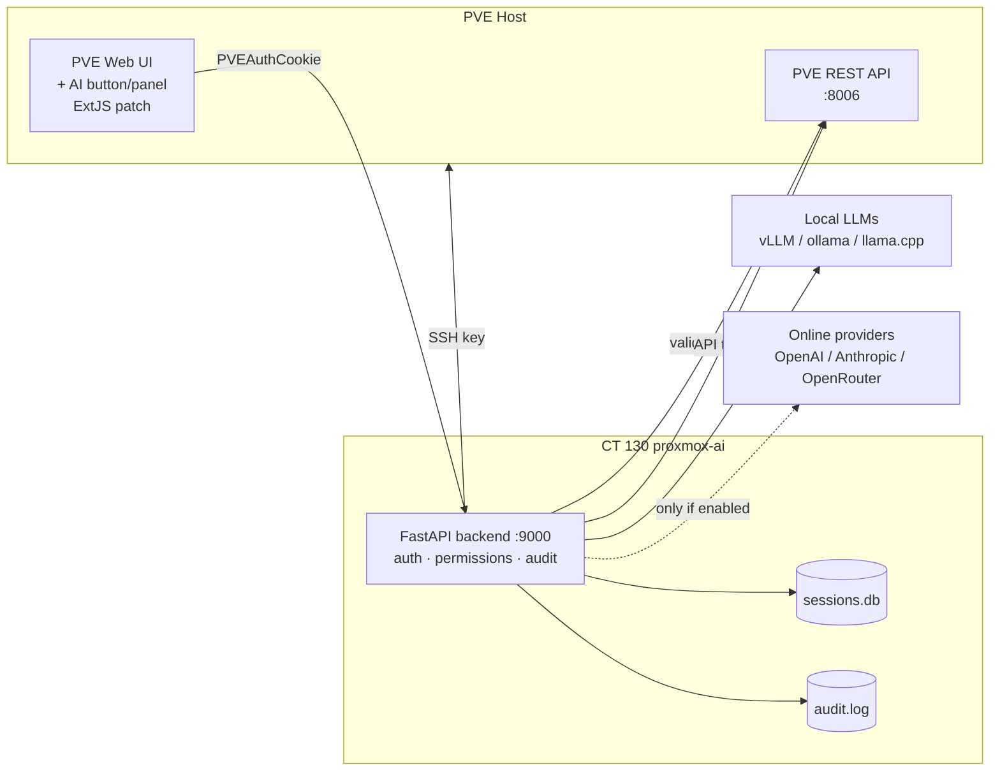

# proxmox-ai

An AI assistant embedded in the Proxmox VE web UI. Chat with a local LLM
(vLLM, ollama, llama.cpp) or online providers (OpenAI, Anthropic, OpenRouter,
any OpenAI-compatible endpoint) — and let it administrate your server or
cluster, only as far as you allow.

## Disclaimer

This is an independent, community-developed project. It is **not affiliated
with, endorsed by, sponsored by, or associated with Proxmox Server Solutions
GmbH** in any way. "Proxmox", "Proxmox VE", and related marks are trademarks
of Proxmox Server Solutions GmbH; all other trademarks are the property of
their respective owners.

**This software is provided "as is", without warranty of any kind, express or
implied**, including but not limited to the warranties of merchantability,
fitness for a particular purpose, and noninfringement. In no event shall the
authors or copyright holders be liable for any claim, damages, data loss, or
other liability — whether in an action of contract, tort, or otherwise —
arising from, out of, or in connection with the software or the use or other
dealings in the software.

This tool can execute commands on your systems with elevated privileges,
including commands generated by a large language model. **LLM output can be
wrong, destructive, or insecure.** You are solely responsible for reviewing
proposed commands, configuring the permission model appropriately, and any
consequences of running this software. Use at your own risk — preferably not
on production systems you cannot afford to rebuild.

**Use of this repository's contents for training machine-learning models is
not permitted.**

## Architecture



- **UI**: `frontend/` — ExtJS button + chat window + settings, injected into
  `pvemanagerlib.js` by `frontend/patch.sh` (same mechanism as the
  subscription-popup patch). A dpkg hook re-applies after `pve-manager` updates.
- **Backend**: `backend/` — FastAPI service in a dedicated CT. Validates the
  user's PVE session, brokers LLM calls, enforces the security model, executes
  approved commands, logs everything.

## Security model

Default posture after install: **everything off except chat with a local
provider you configure.** The admin opts into power.

| Control | What it does |
|---------|--------------|
| `server_access` | Master switch for all command execution |
| `internet_access` | Off = provider base URLs must be RFC1918/loopback |
| `online_providers` | Off = only local provider types (vllm/ollama/llamacpp) |
| `guest_exec` | Off = no `qm agent exec` / `pct exec` |
| `ssh_mode` | `off` / `confirm` / `allowlist` / `auto` |
| Category matrix | Per-category `off`/`confirm`/`allow`: read_status, vmct_lifecycle, storage, network_firewall, users, host_system, guest_exec |
| Denylist | Destructive commands (rm -rf /, mkfs, zpool destroy, shutdown, …) **always** require approval, even in full-auto |
| Rate limit | Max commands/minute (default 10) |
| Kill switch | `touch /etc/proxmox-ai/DISABLED` → all chat/exec endpoints return 503 instantly |
| Audit | Append-only JSONL at `/var/log/proxmox-ai/audit.log`, viewable in the UI |

Auth: the panel forwards the user's `PVEAuthCookie`; the backend validates it
against the PVE API and requires admin-equivalent capabilities. Settings
changes require `root@pam`. API keys are stored chmod 600 on the backend and
masked in all API responses.

## Install

Full guide: **`docs/installation.md`** — problems: **`docs/troubleshooting.md`** — permission categories & allowlist: **`docs/permissions.md`**.

On the PVE host, as root:

```bash
cd proxmox-ai
./install.sh
```

Then hard-refresh the PVE UI (Ctrl+Shift+R) and click the **AI** button.
See `docs/ct-setup.md` for details and manual steps.

**First browser visit:** the backend is reached over HTTPS on a separate port
(`:9443`) with the PVE cluster's self-signed CA. Browsers block the AI panel's
requests until that CA is trusted — see `docs/browser-tls.md` (one-time setup
per browser). Symptom of skipping this: `NetworkError` / "CORS request did not
succeed" and an empty Providers list.

## Uninstall

```bash
/opt/proxmox-ai/frontend/unpatch.sh          # restore pvemanagerlib.js
rm /etc/apt/apt.conf.d/99proxmox-ai-repatch  # remove dpkg hook
pct stop 130 && pct destroy 130              # remove backend CT
pveum user token remove root@pam proxmox-ai  # revoke API token (if created)
# remove the proxmox-ai pubkey from /root/.ssh/authorized_keys
```

## Development

Run the backend locally (no PVE needed for provider work):

```bash
cd backend
python3 -m venv .venv && .venv/bin/pip install -r requirements.txt
PROXMOX_AI_CONFIG=./dev-config.json \
PROXMOX_AI_AUDIT=./dev-audit.log \
PROXMOX_AI_SESSIONS=./dev-sessions.db \
.venv/bin/uvicorn app:app --port 9000
```

## Status

v0.1 — see `PLAN.md` and `task-list-01.md`. Backlog: native tool-calling
(Hermes), backend TLS, RAG over logs, per-user AI profiles.
